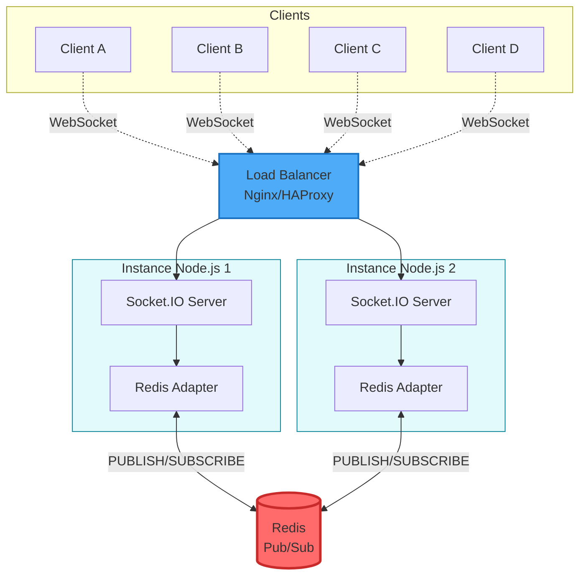

# Réponses - Partie 1 : Théorie (Applications Web Temps Réel)

**Étudiant :** [Votre Nom]  
**Date :** 10 octobre 2025  
**Durée :** 4h00

---

## Question 1 – Les technologies temps réel

### Polling Long (Long Polling)

**Principe de fonctionnement :** Le client envoie une requête HTTP au serveur qui la maintient ouverte jusqu'à ce qu'une nouvelle donnée soit disponible ou qu'un timeout survienne. Après réception de la réponse, le client relance immédiatement une nouvelle requête, créant ainsi une connexion quasi-permanente.

**Sens de communication :** Principalement serveur → client, mais le client peut envoyer des données via des requêtes HTTP classiques séparées.

**Avantages :** Compatible avec tous les proxies et firewalls HTTP, fonctionne sur tous les navigateurs, simple à implémenter. Pas besoin de protocole spécial.

**Limites :** Latence importante (délai entre envoi et réception), surcharge serveur avec de nombreux clients (une connexion par client), consommation élevée de ressources, en-têtes HTTP répétés à chaque requête.

**Cas d'usage typique :** Applications de notifications peu fréquentes, systèmes de messagerie basiques où la latence de quelques secondes est acceptable, fallback pour les environnements où WebSockets n'est pas supporté.

### Server-Sent Events (SSE)

**Principe de fonctionnement :** Connexion HTTP persistante unidirectionnelle où le serveur envoie un flux continu de données textuelles au client via le protocole EventSource. Le serveur pousse les événements au format `data: message\n\n`.

**Sens de communication :** Strictement unidirectionnel serveur → client. Pour envoyer des données, le client doit utiliser des requêtes HTTP classiques (AJAX, Fetch).

**Avantages :** Simple à implémenter côté serveur, reconnexion automatique native, gestion des ID d'événements pour reprendre après déconnexion, fonctionne sur HTTP/1.1 et HTTP/2, compatible avec les proxies HTTP.

**Limites :** Unidirectionnel uniquement, limitation à 6 connexions par domaine (navigateurs), format texte seulement, pas de support natif sur Internet Explorer, moins efficace que WebSocket pour le bidirectionnel.

**Cas d'usage typique :** Flux de notifications en temps réel (Twitter feed, actualités), tableaux de bord de monitoring, cotations boursières, mises à jour de scores sportifs, systèmes où seul le serveur pousse des données.

### WebSockets

**Principe de fonctionnement :** Protocole de communication full-duplex sur une seule connexion TCP. Après un handshake HTTP initial (upgrade), la connexion passe au protocole WebSocket permettant des échanges bidirectionnels avec overhead minimal (2-14 octets par frame).

**Sens de communication :** Bidirectionnel complet (client ↔ serveur), permettant l'envoi et la réception simultanés de données par les deux parties.

**Avantages :** Latence très faible, communication bidirectionnelle native, faible overhead après établissement, supporte données binaires et texte, idéal pour applications interactives temps réel, efficacité réseau maximale.

**Limites :** Complexité d'implémentation, certains proxies/firewalls peuvent bloquer, nécessite gestion manuelle de la reconnexion, pas de support natif sur anciens navigateurs, requiert infrastructure WebSocket côté serveur.

**Cas d'usage typique :** Applications de chat en temps réel, jeux multijoueurs en ligne, éditeurs collaboratifs (Google Docs), trading en temps réel, applications IoT nécessitant bidirectionnalité et faible latence.

---

## Question 2 – Les fondements de Socket.IO

### Namespaces

**Rôle et intérêt :** Les namespaces permettent de segmenter logiquement une application Socket.IO en créant des canaux de communication séparés sur une même connexion. Chaque namespace est un point de connexion indépendant avec ses propres événements, middleware et rooms. Ils permettent d'organiser le code et d'isoler différentes fonctionnalités.

**Exemple concret :** Dans une application d'entreprise, on peut avoir `/admin` pour les administrateurs, `/support` pour le service client, et `/public` pour les utilisateurs. Un utilisateur connecté à `/public` ne recevra jamais les messages envoyés sur `/admin`, assurant ainsi la séparation des préoccupations et la sécurité.

```javascript
// Serveur
const adminNamespace = io.of('/admin');
const publicNamespace = io.of('/public');

adminNamespace.on('connection', (socket) => {
  // Logique spécifique aux admins
});
```

### Rooms

**Rôle et intérêt :** Les rooms sont des canaux arbitraires que les sockets peuvent rejoindre ou quitter au sein d'un namespace. Elles permettent de diffuser des messages à un sous-ensemble spécifique de clients connectés sans avoir à maintenir manuellement des listes de sockets. Chaque socket possède automatiquement une room privée identifiée par son ID.

**Exemple concret :** Dans une application de chat, chaque conversation ou salon peut être une room. Quand un utilisateur envoie un message dans "room-nodejs", seuls les membres de cette room le reçoivent. Les utilisateurs peuvent rejoindre/quitter dynamiquement plusieurs rooms.

```javascript
// Un utilisateur rejoint une room
socket.join('room-nodejs');

// Envoi à tous les membres de la room sauf l'émetteur
socket.to('room-nodejs').emit('message', 'Hello room!');
```

### Broadcast

**Rôle et intérêt :** Le broadcast permet d'envoyer un message à tous les clients connectés **sauf l'émetteur**. C'est un mécanisme essentiel pour propager des informations sans créer de boucle (éviter qu'un client reçoive son propre message). Il peut s'appliquer au namespace entier ou à une room spécifique.

**Exemple concret :** Dans un éditeur collaboratif, quand un utilisateur modifie le document, son client envoie la modification au serveur qui la diffuse (broadcast) à tous les autres utilisateurs connectés sur ce document, mais pas à l'émetteur qui a déjà la modification localement.

```javascript
// Broadcast à tous sauf l'émetteur
socket.broadcast.emit('user-joined', socket.id);

// Broadcast dans une room spécifique
socket.to('document-123').emit('document-update', changes);
```

---

## Question 3 – Scalabilité et Redis Pub/Sub

### 1. Pourquoi les messages peuvent ne pas atteindre tous les clients ?

Quand plusieurs instances Socket.IO tournent derrière un load balancer, chaque instance maintient sa propre liste de clients connectés en mémoire. Si un client A connecté à l'instance 1 envoie un message, seule l'instance 1 reçoit cet événement. Quand cette instance fait un `broadcast`, elle ne peut envoyer le message qu'aux clients connectés **localement** à elle-même. Les clients connectés aux instances 2, 3, etc. ne recevront jamais ce message car il n'y a aucun mécanisme de communication inter-instances par défaut. Chaque serveur Node.js fonctionne en isolation.

### 2. Comment Redis Pub/Sub résout ce problème

Redis Pub/Sub agit comme un bus de messages central. L'adaptateur Redis pour Socket.IO publie automatiquement tous les événements broadcast sur un canal Redis. Toutes les instances Socket.IO souscrivent à ce canal. Ainsi, quand l'instance 1 émet un broadcast, elle publie sur Redis, et **toutes** les instances (1, 2, 3...) reçoivent ce message via leur souscription Redis et le redistribuent à leurs clients locaux respectifs. Redis synchronise donc l'état des événements entre toutes les instances, permettant une communication globale.

### 3. Architecture Socket.IO + Redis Adapter



**Flux d'un message :**
1. **Client A (Instance 1)** → `emit('message')`
2. **Instance 1** → `PUBLISH` sur Redis canal 'socket.io'
3. **Redis** → broadcast à toutes instances souscrites
4. **Instances 1 & 2** → reçoivent via `SUBSCRIBE`
5. **Chaque instance** → `emit` aux clients locaux (B, C, D)

**Composants clés :**
- **Load Balancer :** Répartit les connexions WebSocket (sticky sessions recommandées)
- **Instances Node.js :** Serveurs Socket.IO multiples en parallèle
- **Redis :** Serveur central de messagerie Pub/Sub
- **Redis Adapter :** Bibliothèque (@socket.io/redis-adapter) qui connecte Socket.IO à Redis

---

## Question 4 – Sécurité et Monitoring

### 1. Trois risques de sécurité

**a) Injection et XSS (Cross-Site Scripting) :** Les messages reçus via WebSocket/Socket.IO ne passent pas par les protections habituelles du navigateur. Un attaquant peut injecter du code malveillant dans les messages qui sera exécuté côté client si les données ne sont pas correctement échappées/sanitizées avant affichage.

**b) Déni de service (DoS) et flood :** Un attaquant peut ouvrir de nombreuses connexions WebSocket simultanées ou envoyer un volume massif de messages, saturant le serveur et empêchant les utilisateurs légitimes de se connecter. Sans rate limiting, le serveur peut être facilement submergé.

**c) Absence d'authentification/autorisation :** Les connexions WebSocket peuvent être établies sans authentification adéquate. Un attaquant peut se connecter, rejoindre des rooms sensibles ou écouter/envoyer des messages sans être autorisé, compromettant la confidentialité et l'intégrité des données échangées.

### 2. Trois bonnes pratiques de sécurité

**a) Authentification et validation systématique :** Implémenter un middleware d'authentification Socket.IO pour vérifier les tokens JWT ou sessions avant d'accepter la connexion. Valider et autoriser chaque action (join room, emit event) côté serveur. Ne jamais faire confiance aux données client.

```javascript
io.use((socket, next) => {
  const token = socket.handshake.auth.token;
  if (isValidToken(token)) next();
  else next(new Error('Authentication failed'));
});
```

**b) Rate limiting et throttling :** Limiter le nombre de connexions par IP, le nombre de messages par seconde par socket, et implémenter des timeouts. Déconnecter automatiquement les clients abusifs. Utiliser des bibliothèques comme `express-rate-limit` ou implémenter des compteurs personnalisés.

**c) Sanitization et validation des données :** Échapper/sanitizer toutes les données entrantes avant traitement ou redistribution. Valider le format, le type et la longueur des messages. Côté client, utiliser `textContent` plutôt que `innerHTML` pour afficher les messages utilisateur et éviter l'exécution de scripts.

### 3. Trois métriques à surveiller

**a) Nombre de connexions actives :** Permet de détecter les pics anormaux (attaque DoS) ou la croissance de charge. Aide au dimensionnement de l'infrastructure et à l'identification de fuites mémoire si le nombre ne décroît jamais.

**b) Latence et temps de réponse :** Mesurer le temps entre l'émission d'un message et sa réception (ping/pong). Une latence croissante indique une saturation serveur, des problèmes réseau ou une base de données lente.

**c) Taux d'erreurs et déconnexions :** Nombre d'erreurs de connexion, d'échecs d'authentification, de timeouts, et de déconnexions anormales. Un taux élevé signale des problèmes de stabilité, configuration ou attaques potentielles.

### 4. Outils et techniques de monitoring

**Console et logs structurés :** Logger les événements importants (connexions, erreurs, déconnexions) avec Winston ou Pino. Centraliser les logs avec ELK Stack (Elasticsearch, Logstash, Kibana) ou Loki pour analyse.

**Prometheus + Grafana :** Exposer des métriques Socket.IO (connexions actives, messages/sec, latence) via `prom-client` pour Node.js. Prometheus scrappe ces métriques et Grafana les visualise en temps réel avec alertes configurables.

**Métriques internes Socket.IO :** Utiliser `io.engine.clientsCount`, tracker les événements `connection` et `disconnect`, mesurer la mémoire (`process.memoryUsage()`). Implémenter un endpoint `/health` ou `/metrics` pour exposition HTTP.

---

## Question 5 – Bonnes pratiques

### 1. Authentification et autorisation robustes
Toujours authentifier les connexions WebSocket/Socket.IO via middleware avec tokens JWT ou sessions sécurisées. Vérifier les autorisations pour chaque action sensible (join room, accès données). Ne jamais exposer de logique métier critique côté client sans validation serveur.

### 2. Gestion des reconnexions automatiques
Implémenter une stratégie de reconnexion exponentielle côté client avec backoff pour éviter de surcharger le serveur. Côté serveur, gérer les reprises de session et restaurer l'état client (rooms, contexte) après reconnexion pour garantir la continuité de service.

### 3. Validation et sanitization systématiques
Valider tous les payloads entrants (type, format, taille) côté serveur avant traitement. Limiter la taille maximale des messages pour prévenir les attaques par saturation mémoire. Échapper les données avant affichage côté client pour éviter XSS.

### 4. Optimisation des messages et compression
Minimiser la taille des payloads JSON en envoyant uniquement les données nécessaires. Activer la compression WebSocket (`perMessageDeflate`) pour réduire la bande passante. Agréger les mises à jour fréquentes (debouncing/throttling) pour limiter le nombre de messages.

### 5. Monitoring, logging et gestion des erreurs
Implémenter un système complet de logging (connexions, erreurs, performances) et exposer des métriques temps réel (Prometheus). Gérer gracieusement toutes les erreurs avec try-catch et événements `error`. Configurer des alertes sur les seuils critiques (connexions, latence, erreurs) pour intervention proactive.

**Bonus :** Utiliser des rate limiters, implémenter des health checks, tester la charge avec Artillery ou K6, documenter l'API Socket.IO, et maintenir une séparation claire entre logique métier et transport temps réel.

---