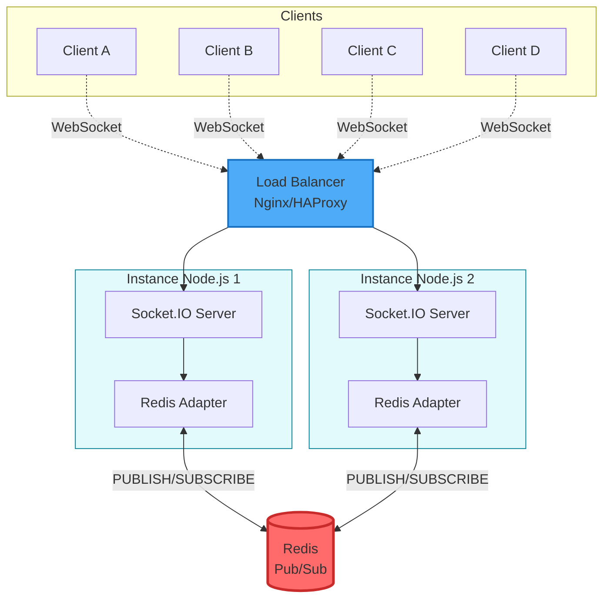

## Question 1 – Les technologies temps réel

### Polling Long (Long Polling)

**Principe de fonctionnement :** Le client envoie une requête HTTP au serveur, qui la garde ouverte jusqu’à ce qu’une nouvelle donnée soit prête ou qu’un délai expire. Dès que le client reçoit une réponse, il renvoie immédiatement une nouvelle requête. Cela crée une sorte de connexion presque continue.

**Sens de communication :** Principalement du serveur vers le client. Le client peut tout de même envoyer des données via des requêtes HTTP classiques.

**Avantages :** Fonctionne partout (navigateurs, proxies, firewalls), très simple à mettre en place et ne nécessite aucun protocole particulier.

**Limites :** Latence parfois élevée, surcharge côté serveur quand il y a beaucoup de clients, consommation importante de ressources et répétition d’en-têtes HTTP à chaque requête.

**Cas d'usage typique :** Notifications occasionnelles, messageries simples ou environnements ne supportant pas WebSockets.

### Server-Sent Events (SSE)

**Principe de fonctionnement :** SSE repose sur une connexion HTTP persistante unidirectionnelle. Le serveur envoie un flux continu de messages texte au client via le protocole `EventSource`. Chaque événement est transmis au format `data: message\n\n`.

**Sens de communication :** Uniquement du serveur vers le client. Si le client veut envoyer des données, il passe par une requête HTTP classique.

**Avantages :** Mise en œuvre simple côté serveur, reconnexion automatique gérée nativement, gestion des ID d’événements pour reprendre après déconnexion. Compatible HTTP/1.1 et HTTP/2.

**Limites :** Unidirectionnel, limité à 6 connexions par domaine dans les navigateurs, uniquement du texte, non pris en charge par Internet Explorer.

**Cas d'usage typique :** Flux d’actualités, tableaux de bord, cotations boursières, scores sportifs ou toute application où seul le serveur pousse des données.


### WebSockets

**Principe de fonctionnement :** WebSocket est un protocole full-duplex fonctionnant sur une unique connexion TCP. Après un handshake HTTP initial, la connexion bascule sur le protocole WebSocket, permettant des échanges bidirectionnels en continu avec un overhead minimal.

**Sens de communication :** Bidirectionnel complet — le client et le serveur peuvent envoyer et recevoir des données simultanément.

**Avantages :** Latence très faible, communication bidirectionnelle native, faible consommation réseau, supporte le texte et le binaire, parfait pour les applications interactives temps réel.

**Limites :** Mise en place plus complexe, problèmes possibles avec certains proxies/firewalls, nécessite gestion des reconnexions, et pas supporté par d’anciens navigateurs.

**Cas d'usage typique :** Chats temps réel, jeux multijoueurs, éditeurs collaboratifs, trading en direct, ou systèmes IoT nécessitant une communication rapide et continue.

---

## Question 2 – Les fondements de Socket.IO

### Namespaces

**Rôle et intérêt :** Les namespaces servent à séparer logiquement différentes parties d’une application Socket.IO, tout en partageant une même connexion. Chaque namespace a ses propres événements, rooms et middleware. Cela facilite l’organisation du code et isole les fonctionnalités.

**Exemple concret :** Dans une application d'entreprise, on peut avoir `/admin` pour les administrateurs, `/support` pour le service client, et `/public` pour les utilisateurs. Un utilisateur connecté à `/public` ne recevra jamais les messages envoyés sur `/admin`, assurant ainsi la séparation des préoccupations et la sécurité.

```javascript
// Serveur
const adminNamespace = io.of('/admin');
const publicNamespace = io.of('/public');

adminNamespace.on('connection', (socket) => {
  // Logique spécifique aux admins
});
```

### Rooms

**Rôle et intérêt :** Les rooms sont comme des sous-canaux au sein d’un namespace. Un socket peut rejoindre ou quitter une room librement. Cela permet de cibler facilement un groupe d’utilisateurs sans devoir gérer des listes manuelles.

**Exemple concret :** Dans une application de chat, chaque conversation ou salon peut être une room. Quand un utilisateur envoie un message dans "room-nodejs", seuls les membres de cette room le reçoivent. Les utilisateurs peuvent rejoindre/quitter dynamiquement plusieurs rooms.

```javascript
// Un utilisateur rejoint une room
socket.join('room-nodejs');

// Envoi à tous les membres de la room sauf l'émetteur
socket.to('room-nodejs').emit('message', 'Hello room!');
```

### Broadcast

**Rôle et intérêt :** Le broadcast envoie un message à tous les clients sauf celui qui l’a émis. C’est pratique pour éviter les boucles (par exemple, quand un client envoie un message qu’il n’a pas besoin de recevoir lui-même).

**Exemple concret :** Dans un éditeur collaboratif, quand un utilisateur modifie le document, son client envoie la modification au serveur qui la diffuse (broadcast) à tous les autres utilisateurs connectés sur ce document, mais pas à l'émetteur qui a déjà la modification localement.

```javascript
// Broadcast à tous sauf l'émetteur
socket.broadcast.emit('user-joined', socket.id);

// Broadcast dans une room spécifique
socket.to('document-123').emit('document-update', changes);
```

---

## Question 3 – Scalabilité et Redis Pub/Sub

### 1. Pourquoi les messages peuvent ne pas atteindre tous les clients ?

Quand plusieurs serveurs Socket.IO tournent derrière un load balancer, chacun garde sa propre liste de clients. Si un client connecté à l’instance 1 envoie un message, seuls les utilisateurs sur cette instance le recevront. Les autres serveurs n’en sauront rien — il n’y a pas de communication native entre instances.

### 2. Comment Redis Pub/Sub résout ce problème

Redis agit comme un bus de messages centralisé. Grâce à l’adaptateur Redis, chaque serveur publie ses messages sur un canal Redis. Tous les autres serveurs abonnés à ce canal les reçoivent à leur tour et les redistribuent à leurs propres clients. Cela garantit que tout le monde reste synchronisé, quelle que soit l’instance.

### 3. Architecture Socket.IO + Redis Adapter



**Flux d'un message :**
1. **Client A (Instance 1)** → `emit('message')`
2. **Instance 1** → `PUBLISH` sur Redis canal 'socket.io'
3. **Redis** → broadcast à toutes instances souscrites
4. **Instances 1 & 2** → reçoivent via `SUBSCRIBE`
5. **Chaque instance** → `emit` aux clients locaux (B, C, D)

**Composants clés :**
- **Load Balancer :** Répartit les connexions WebSocket (sticky sessions recommandées)
- **Instances Node.js :** Serveurs Socket.IO multiples en parallèle
- **Redis :** Serveur central de messagerie Pub/Sub
- **Redis Adapter :** Bibliothèque (@socket.io/redis-adapter) qui connecte Socket.IO à Redis

---

## Question 4 – Sécurité et Monitoring

### 1. Trois risques de sécurité

**a) Injection et XSS (Cross-Site Scripting) :** Les messages reçus via WebSocket/Socket.IO ne passent pas par les protections habituelles du navigateur. Un attaquant peut injecter du code malveillant dans les messages qui sera exécuté côté client si les données ne sont pas correctement échappées/sanitizées avant affichage.

**b) Déni de service (DoS) et flood :** Un attaquant peut ouvrir de nombreuses connexions WebSocket simultanées ou envoyer un volume massif de messages, saturant le serveur et empêchant les utilisateurs légitimes de se connecter. Sans rate limiting, le serveur peut être facilement submergé.

**c) Absence d'authentification/autorisation :** Les connexions WebSocket peuvent être établies sans authentification adéquate. Un attaquant peut se connecter, rejoindre des rooms sensibles ou écouter/envoyer des messages sans être autorisé, compromettant la confidentialité et l'intégrité des données échangées.

### 2. Trois bonnes pratiques de sécurité

**a) Authentification et validation systématique :** Implémenter un middleware d'authentification Socket.IO pour vérifier les tokens JWT ou sessions avant d'accepter la connexion. Valider et autoriser chaque action (join room, emit event) côté serveur. Ne jamais faire confiance aux données client.

```javascript
io.use((socket, next) => {
  const token = socket.handshake.auth.token;
  if (isValidToken(token)) next();
  else next(new Error('Authentication failed'));
});
```

**b) Rate limiting et throttling :** Limiter le nombre de connexions par IP, le nombre de messages par seconde par socket, et implémenter des timeouts. Déconnecter automatiquement les clients abusifs. Utiliser des bibliothèques comme `express-rate-limit` ou implémenter des compteurs personnalisés.

**c) Sanitization et validation des données :** Échapper/sanitizer toutes les données entrantes avant traitement ou redistribution. Valider le format, le type et la longueur des messages. Côté client, utiliser `textContent` plutôt que `innerHTML` pour afficher les messages utilisateur et éviter l'exécution de scripts.

### 3. Trois métriques à surveiller

**a) Nombre de connexions actives :** Permet de détecter les pics anormaux (attaque DoS) ou la croissance de charge. Aide au dimensionnement de l'infrastructure et à l'identification de fuites mémoire si le nombre ne décroît jamais.

**b) Latence et temps de réponse :** Mesurer le temps entre l'émission d'un message et sa réception (ping/pong). Une latence croissante indique une saturation serveur, des problèmes réseau ou une base de données lente.

**c) Taux d'erreurs et déconnexions :** Nombre d'erreurs de connexion, d'échecs d'authentification, de timeouts, et de déconnexions anormales. Un taux élevé signale des problèmes de stabilité, configuration ou attaques potentielles.

### 4. Outils et techniques de monitoring

**Console et logs structurés :** Logger les événements importants (connexions, erreurs, déconnexions) avec Winston ou Pino. Centraliser les logs avec ELK Stack (Elasticsearch, Logstash, Kibana) ou Loki pour analyse.

**Prometheus + Grafana :** Exposer des métriques Socket.IO (connexions actives, messages/sec, latence) via `prom-client` pour Node.js. Prometheus scrappe ces métriques et Grafana les visualise en temps réel avec alertes configurables.

**Métriques internes Socket.IO :** Utiliser `io.engine.clientsCount`, tracker les événements `connection` et `disconnect`, mesurer la mémoire (`process.memoryUsage()`). Implémenter un endpoint `/health` ou `/metrics` pour exposition HTTP.

---

## Question 5 – Bonnes pratiques

### 1. Authentification et autorisation robustes
Toujours authentifier les connexions WebSocket/Socket.IO via middleware avec tokens JWT ou sessions sécurisées. Vérifier les autorisations pour chaque action sensible (join room, accès données). Ne jamais exposer de logique métier critique côté client sans validation serveur.

### 2. Gestion des reconnexions automatiques
Implémenter une stratégie de reconnexion exponentielle côté client avec backoff pour éviter de surcharger le serveur. Côté serveur, gérer les reprises de session et restaurer l'état client (rooms, contexte) après reconnexion pour garantir la continuité de service.

### 3. Validation et sanitization systématiques
Valider tous les payloads entrants (type, format, taille) côté serveur avant traitement. Limiter la taille maximale des messages pour prévenir les attaques par saturation mémoire. Échapper les données avant affichage côté client pour éviter XSS.

### 4. Optimisation des messages et compression
Minimiser la taille des payloads JSON en envoyant uniquement les données nécessaires. Activer la compression WebSocket (`perMessageDeflate`) pour réduire la bande passante. Agréger les mises à jour fréquentes (debouncing/throttling) pour limiter le nombre de messages.

### 5. Monitoring, logging et gestion des erreurs
Implémenter un système complet de logging (connexions, erreurs, performances) et exposer des métriques temps réel (Prometheus). Gérer gracieusement toutes les erreurs avec try-catch et événements `error`. Configurer des alertes sur les seuils critiques (connexions, latence, erreurs) pour intervention proactive.

**Bonus :** Utiliser des rate limiters, implémenter des health checks, tester la charge avec Artillery ou K6, documenter l'API Socket.IO, et maintenir une séparation claire entre logique métier et transport temps réel.

---