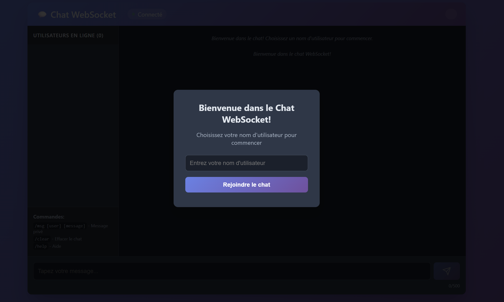
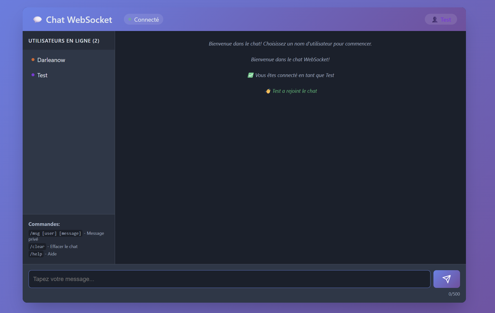
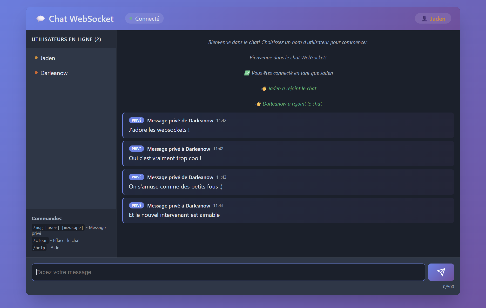

# 💬 Chat WebSocket - Application de messagerie en temps réel

## 📋 Description

Application de chat en temps réel utilisant WebSocket pour permettre une communication bidirectionnelle instantanée entre plusieurs clients. L'application inclut toutes les fonctionnalités bonus demandées dans le TP.

## ✨ Fonctionnalités

### Fonctionnalités de base
- ✅ Connexion WebSocket persistante entre client et serveur
- ✅ Envoi et réception de messages en temps réel
- ✅ Broadcast des messages à tous les clients connectés
- ✅ Interface web moderne et responsive

### Fonctionnalités bonus implémentées
- 👤 **Noms d'utilisateur** : Chaque client peut choisir un nom unique avec une couleur personnalisée
- 🔌 **Gestion des déconnexions** : Notification lorsqu'un utilisateur se connecte ou se déconnecte
- 💬 **Messages privés** : Envoi de messages privés avec la commande `/msg [utilisateur] [message]`
- 🎨 **Interface améliorée** : Design moderne avec CSS avancé, animations et thème sombre
- 📝 **Indicateur de frappe** : Affichage en temps réel des utilisateurs en train d'écrire
- 🔔 **Notifications sonores** : Son de notification pour les nouveaux messages
- 👥 **Liste des utilisateurs** : Sidebar affichant tous les utilisateurs connectés
- 🔄 **Reconnexion automatique** : Tentatives de reconnexion en cas de perte de connexion
- 📊 **Compteur de caractères** : Limite et affichage du nombre de caractères

## 🚀 Installation et lancement

### Prérequis
- Node.js (v14 ou supérieur)
- npm (gestionnaire de paquets Node.js)

### Installation

1. Clonez ou téléchargez le projet :
```bash
git clone [URL_DU_REPO]
cd tp-websocket-chat
```

2. Installez les dépendances :
```bash
npm install
```

### Lancement du serveur

```bash
npm start
```

Ou pour le mode développement avec auto-reload :
```bash
npm run dev
```

Le serveur démarre sur le port 8080 par défaut.

### Accès au client

Ouvrez votre navigateur et accédez à :
```
http://localhost:8080
```

Pour tester le chat multi-utilisateurs, ouvrez plusieurs onglets ou navigateurs différents.

## 📁 Structure du projet

```
tp-websocket-chat/
├── server.js           # Serveur WebSocket Node.js
├── package.json        # Configuration npm et dépendances
├── README.md          # Documentation
└── client/            # Fichiers client
    ├── index.html     # Interface HTML
    ├── css/
    │   └── styles.css # Styles CSS
    └── js/
        └── chat.js    # Logique JavaScript client
```

## 🛠️ Technologies utilisées

### Backend
- **Node.js** : Environnement d'exécution JavaScript
- **ws** : Bibliothèque WebSocket pour Node.js
- **http** : Module natif Node.js pour servir les fichiers statiques

### Frontend
- **HTML5** : Structure de la page
- **CSS3** : Styles avec animations et design responsive
- **JavaScript ES6+** : Logique client et gestion WebSocket
- **WebSocket API** : Communication temps réel

## 📝 Principales étapes d'implémentation

### 1. Serveur WebSocket (server.js)
- Création d'un serveur HTTP pour servir les fichiers statiques
- Initialisation du serveur WebSocket avec la bibliothèque `ws`
- Gestion des connexions/déconnexions des clients
- Système de broadcast pour diffuser les messages
- Gestion des messages privés et des commandes
- Stockage des informations clients (username, couleur)

### 2. Client WebSocket (client/js/chat.js)
- Établissement de la connexion WebSocket
- Gestion des événements (connexion, messages, déconnexion)
- Interface pour choisir un nom d'utilisateur
- Envoi et réception de messages
- Affichage de l'indicateur de frappe
- Gestion des commandes (/msg, /clear, /help)

### 3. Interface utilisateur (client/index.html & css/styles.css)
- Modal pour la saisie du nom d'utilisateur
- Zone de chat avec messages et indicateurs
- Sidebar avec liste des utilisateurs connectés
- Design responsive et animations CSS
- Thème sombre moderne avec dégradés

## 🎯 Commandes disponibles

- `/msg [utilisateur] [message]` : Envoyer un message privé
- `/clear` : Effacer le chat (local uniquement)
- `/help` : Afficher l'aide

## 🔧 Défis rencontrés et solutions

### Défi 1 : Gestion des noms d'utilisateur uniques
**Problème** : Éviter les doublons de noms d'utilisateur
**Solution** : Vérification côté serveur avant validation, avec message d'erreur si le nom est déjà pris

### Défi 2 : Messages privés
**Problème** : Router les messages vers un client spécifique
**Solution** : Utilisation d'une Map pour stocker les clients avec leurs informations et recherche par nom d'utilisateur

### Défi 3 : Indicateur de frappe en temps réel
**Problème** : Éviter le spam de messages "typing"
**Solution** : Utilisation d'un timeout pour limiter l'envoi des notifications de frappe

### Défi 4 : Reconnexion automatique
**Problème** : Gérer la perte de connexion réseau
**Solution** : Implémentation d'un système de retry avec nombre maximum de tentatives

### Défi 5 : Interface responsive
**Problème** : Adapter l'interface aux différentes tailles d'écran
**Solution** : Media queries CSS et masquage de la sidebar sur mobile

## 📸 Captures d'écran

### Connexion et choix du nom d'utilisateur


### Interface de chat principale


### Échange de messages entre plusieurs clients
