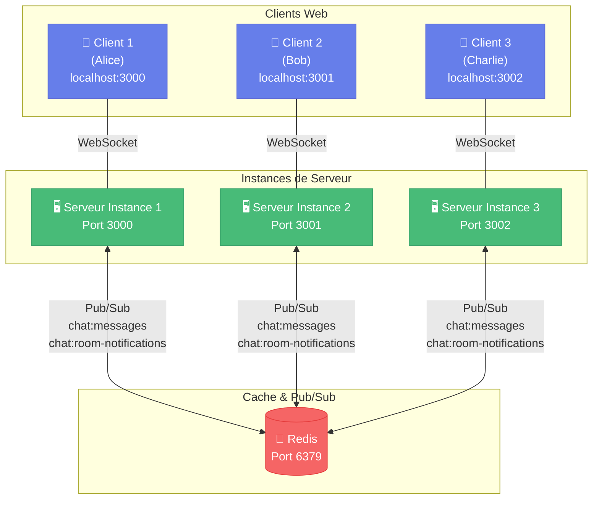

# Chat Multi-Salons avec Redis Pub/Sub

Application de chat en temps réel scalable utilisant Redis Pub/Sub pour la communication entre plusieurs instances de serveur.

## 🎯 Objectif du Projet

Cette application démontre comment utiliser Redis Pub/Sub pour permettre à plusieurs instances d'un serveur de chat de communiquer entre elles, résolvant ainsi le problème de scalabilité horizontale.

### Problème résolu

Sans Redis Pub/Sub, chaque instance de serveur est isolée :
- Les clients connectés au serveur A ne voient pas les messages des clients du serveur B
- Impossible de distribuer la charge sur plusieurs serveurs
- Pas de haute disponibilité

Avec Redis Pub/Sub :
- Tous les messages sont diffusés via Redis
- Chaque instance reçoit tous les messages et les transmet à ses clients locaux
- Scalabilité horizontale : ajoutez autant d'instances que nécessaire
- Haute disponibilité : une instance peut tomber sans affecter les autres

## 🏗️ Architecture



**Flux de données :**
1. 📤 Alice (3000) envoie "Bonjour!" → WebSocket → Serveur Instance 1
2. 📢 Instance 1 publie sur Redis → `PUBLISH chat:messages {...}`
3. 📡 Redis diffuse à TOUTES les instances (1, 2, 3)
4. 📥 Instances 1, 2, 3 reçoivent le message → Envoient via WebSocket à leurs clients
5. ✅ Alice, Bob ET Charlie reçoivent tous le message, même s'ils sont sur des serveurs différents !

## 📁 Structure du Projet

```
exercise_6_chat-multi-salons-with-redis/
├── index.html              # Interface client (HTML/CSS/JS)
├── index-redis.js          # Serveur Node.js avec Redis Pub/Sub ✅
├── index.js                # Ancienne version sans Redis (référence)
├── package.json            # Dépendances et scripts npm
├── docker-compose.yml      # Configuration Docker pour Redis
├── README.md               # Ce fichier
├── .env.example            # Template variables d'environnement
├── .gitignore              # Fichiers à ignorer
└── node_modules/           # Dépendances installées
```

**Note :** Utilisez `index-redis.js` (avec Redis), pas `index.js` (version simple sans scalabilité).

- Node.js (v16 ou supérieur)
- Docker et Docker Compose
- npm ou yarn

## 🚀 Installation

### 1. Cloner et installer les dépendances

```bash
# Installer les dépendances Node.js
npm install
```

### 2. Lancer Redis avec Docker

```bash
# Démarrer Redis en arrière-plan
docker-compose up -d

# Vérifier que Redis fonctionne
docker-compose ps
docker-compose logs redis
```

Pour arrêter Redis :
```bash
docker-compose down
```

Pour arrêter et supprimer les données :
```bash
docker-compose down -v
```

## 🎮 Utilisation

### Scénario 1 : Test avec une seule instance

```bash
npm start
```

Ouvrez votre navigateur sur `http://localhost:3000`

*Note : Avec une seule instance, vous ne verrez pas l'avantage de Redis. Lancez plusieurs instances pour le test complet !*

### Scénario 2 : Test avec plusieurs instances (recommandé)

**Terminal 1 - Instance 1 :**
```bash
npm run start:instance1
```

**Terminal 2 - Instance 2 :**
```bash
npm run start:instance2
```

**Terminal 3 - Instance 3 (optionnel) :**
```bash
npm run start:instance3
```

**Note Windows :** Les scripts npm utilisent `cross-env` pour être compatibles Windows/Linux/Mac. 
Si vous préférez définir le PORT manuellement :
- **CMD :** `set PORT=3000 && node index-redis.js`
- **PowerShell :** `$env:PORT=3000; node index-redis.js`

## 🎯 Guide de Test Complet

### ✅ Checklist de validation

Suivez ces étapes pour vérifier que votre implémentation fonctionne :

#### 1. Vérification de l'infrastructure
```bash
# Redis doit être en cours d'exécution
docker ps
# Vous devez voir : chat-redis ... Up

# Vérifier les logs Redis (optionnel)
docker logs chat-redis
```

#### 2. Démarrage des instances
```bash
# Terminal 1
npm run start:instance1

# Terminal 2  
npm run start:instance2

# Terminal 3 (optionnel)
npm run start:instance3
```

**Dans chaque terminal, vérifiez :**
- ✅ `✓ Connecté à Redis avec succès`
- ✅ `✓ Abonné aux canaux Redis`
- ✅ `🚀 Serveur en écoute sur le port XXXX`

#### 3. Test de synchronisation multi-instances

**Étape A - Ouvrir les clients :**
1. Onglet 1 : `http://localhost:3000` → Pseudo: "Alice", Salon: "general"
2. Onglet 2 : `http://localhost:3001` → Pseudo: "Bob", Salon: "general"
3. Onglet 3 : `http://localhost:3002` → Pseudo: "Charlie", Salon: "general"

**Étape B - Tester la diffusion :**
- Alice (port 3000) envoie : "Bonjour tout le monde !"
- ✅ **Bob et Charlie doivent voir le message immédiatement**

- Bob (port 3001) envoie : "Salut Alice !"
- ✅ **Alice et Charlie doivent voir le message**

**Étape C - Vérifier les logs serveur :**
Dans les 3 terminaux, vous devriez voir :
```
[Local → Redis] [general] Alice: Bonjour tout le monde !
[Redis → Clients] [general] Alice: Bonjour tout le monde !
```

#### 4. Test d'isolation des salons

**Ouvrir 2 nouveaux onglets :**
- Onglet 4 : `http://localhost:3000` → Pseudo: "Dave", Salon: "dev"
- Onglet 5 : `http://localhost:3001` → Pseudo: "Eve", Salon: "dev"

**Tester :**
- Messages dans "general" ne doivent PAS apparaître dans "dev"
- Messages dans "dev" ne doivent PAS apparaître dans "general"
- ✅ Chaque salon est bien isolé

#### 5. Test de résilience

**Arrêter une instance :**
```bash
# Dans le Terminal 2 (instance 2), appuyez sur Ctrl+C
```

**Vérifier :**
- ✅ Les clients sur ports 3000 et 3002 continuent de communiquer
- ✅ Les clients du port 3001 sont déconnectés (normal)
- ✅ La synchronisation fonctionne toujours entre instances 1 et 3

### 🎉 Critères de réussite

Votre TP est validé si :

| Critère | Validation |
|---------|-----------|
| Messages synchronisés entre instances | ✅ Alice (3000) → Bob (3001) fonctionne |
| Isolation par salon | ✅ Messages "general" ≠ messages "dev" |
| Plusieurs instances simultanées | ✅ 3+ instances fonctionnent ensemble |
| Résilience | ✅ Une instance peut s'arrêter sans tout casser |
| Notifications de connexion/déconnexion | ✅ Visibles dans tous les clients du salon |
| Code clair et documenté | ✅ Logs explicites, README complet |

### Test de la synchronisation

1. **Ouvrez plusieurs onglets de navigateur :**
   - Onglet 1 : `http://localhost:3000` (connecté à l'instance 1)
   - Onglet 2 : `http://localhost:3001` (connecté à l'instance 2)
   - Onglet 3 : `http://localhost:3000` (connecté à l'instance 1)

2. **Rejoignez le même salon :**
   - Utilisez des pseudos différents
   - Rejoignez tous le même salon (ex: "general")

3. **Envoyez des messages :**
   - Envoyez un message depuis n'importe quel onglet
   - **Résultat attendu :** Tous les onglets reçoivent le message, quelle que soit l'instance à laquelle ils sont connectés

4. **Testez avec différents salons :**
   - Créez plusieurs salons ("dev", "random", etc.)
   - Vérifiez que les messages restent isolés par salon
   - Vérifiez que la synchronisation fonctionne même avec plusieurs salons actifs

## 🔧 Configuration

### Variables d'environnement

Créez un fichier `.env` (optionnel) :

```env
PORT=3000
REDIS_HOST=localhost
REDIS_PORT=6379
REDIS_PASSWORD=your_redis_password
```

### Modifier le mot de passe Redis

Dans `docker-compose.yml`, changez :
```yaml
REDIS_ARGS=--requirepass votre_nouveau_mot_de_passe
```

Puis mettez à jour la variable `REDIS_PASSWORD` dans votre `.env` ou directement dans `index-redis.js`.

## 📊 Fonctionnement de Redis Pub/Sub

### Canaux utilisés

1. **`chat:messages`** : Diffusion des messages de chat
   - Format : `{ username, room, message, time }`
   
2. **`chat:room-notifications`** : Notifications de connexion/déconnexion
   - Format : `{ room, message }`

### Flux de données

1. **Envoi d'un message :**
   ```
   Client → WebSocket → Serveur local
   Serveur local → Redis PUBLISH (chat:messages)
   Redis → TOUS les serveurs abonnés
   Chaque serveur → WebSocket → Ses clients locaux
   ```

2. **Pourquoi deux clients Redis ?**
   - **Publisher** : Publie les messages sur Redis
   - **Subscriber** : Écoute les messages de Redis (opération bloquante)
   - Redis ne permet pas d'utiliser le même client pour publier et s'abonner

### Avantages de cette architecture

✅ **Scalabilité horizontale** : Ajoutez des instances à volonté
✅ **Haute disponibilité** : Si une instance tombe, les autres continuent
✅ **Performance** : Charge distribuée sur plusieurs serveurs
✅ **Simplicité** : Redis gère la complexité de la distribution
✅ **Temps réel** : Pub/Sub est conçu pour la diffusion instantanée

## 🧪 Tests de charge

### Simuler une charge élevée

**Linux/Mac :**
```bash
# Lancez 5 instances en arrière-plan
for port in {3000..3004}; do
  PORT=$port node index-redis.js &
done
```

**Windows CMD :**
```cmd
start cmd /k "set PORT=3000 && node index-redis.js"
start cmd /k "set PORT=3001 && node index-redis.js"
start cmd /k "set PORT=3002 && node index-redis.js"
start cmd /k "set PORT=3003 && node index-redis.js"
start cmd /k "set PORT=3004 && node index-redis.js"
```

**Windows PowerShell :**
```powershell
3000..3004 | ForEach-Object { Start-Process powershell -ArgumentList "-NoExit", "-Command", "`$env:PORT=$_; node index-redis.js" }
```

### Outil de test de charge (optionnel)

```bash
# Installer Artillery
npm install -g artillery

# Tester la charge
artillery quick --count 100 --num 10 http://localhost:3000
```

## 🐛 Dépannage

### Redis ne démarre pas

```bash
# Vérifier les logs
docker-compose logs redis

# Redémarrer Redis
docker-compose restart redis
```

### Erreur de connexion Redis

```bash
# Vérifier que Redis est accessible
docker exec -it chat-redis redis-cli ping
# Devrait répondre : PONG

# Tester avec le mot de passe
docker exec -it chat-redis redis-cli -a your_redis_password ping
```

### Les messages ne se synchronisent pas

1. Vérifiez que toutes les instances sont connectées à Redis (logs : "✓ Connecté à Redis")
2. Vérifiez les logs Redis : `docker-compose logs -f redis`
3. Vérifiez que les clients sont bien dans le même salon

### Monitorer Redis

```bash
# Se connecter à Redis CLI
docker exec -it chat-redis redis-cli -a your_redis_password

# Surveiller les messages en temps réel
> MONITOR

# Voir les abonnements actifs
> PUBSUB CHANNELS
> PUBSUB NUMSUB chat:messages
```

## 📚 Concepts clés

### WebSocket vs Redis Pub/Sub

- **WebSocket** : Communication client ↔ serveur (temps réel)
- **Redis Pub/Sub** : Communication serveur ↔ serveur (synchronisation)

### Isolation par salon

Les salons Socket.IO (`socket.join(room)`) fonctionnent localement sur chaque serveur. Redis permet de synchroniser les messages entre les serveurs, mais chaque serveur gère ses propres salons.

### Persistance

⚠️ Redis Pub/Sub n'est **pas persistant** :
- Les messages ne sont pas stockés
- Si aucun serveur n'est abonné, le message est perdu
- Pour la persistance, utilisez Redis Streams ou une base de données

## 🚀 Améliorations possibles

1. **Persistance des messages** : Utiliser MongoDB/PostgreSQL
2. **Authentification** : Ajouter JWT pour sécuriser les connexions
3. **Rate limiting** : Limiter le nombre de messages par utilisateur
4. **Présence utilisateur** : Tracker qui est en ligne dans chaque salon
5. **Messages privés** : Support des conversations 1-à-1
6. **Fichiers** : Permettre l'envoi d'images/fichiers
7. **Load balancer** : Nginx pour distribuer automatiquement les connexions
8. **Monitoring** : Prometheus + Grafana pour surveiller les métriques

## 📝 Livrables du TP

- ✅ Code source complet avec Redis Pub/Sub
- ✅ docker-compose.yml pour Redis
- ✅ README.md avec instructions détaillées
- ✅ Scripts npm pour lancer plusieurs instances
- ✅ Documentation de l'architecture

## 📖 Ressources

- [Redis Pub/Sub Documentation](https://redis.io/docs/interact/pubsub/)
- [Socket.IO Documentation](https://socket.io/docs/v4/)
- [Node.js Redis Client](https://github.com/redis/node-redis)

## 👨‍💻 Auteur

Projet réalisé dans le cadre du TP sur la scalabilité d'applications temps réel.

## 📄 Licence

ISC