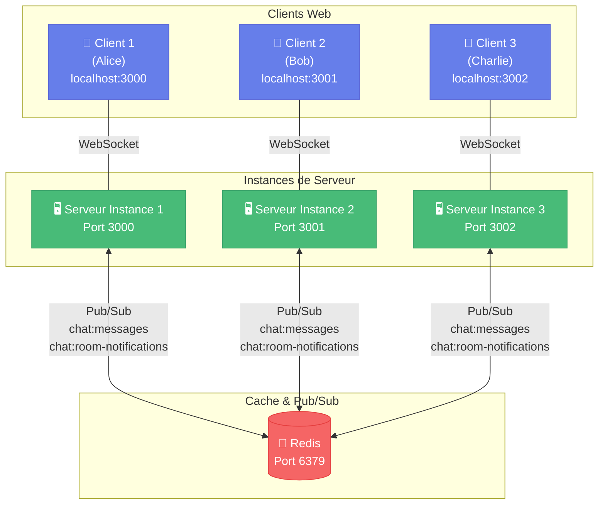

# Chat Multi-Salons avec Redis Pub/Sub

Application de chat en temps réel scalable utilisant Redis Pub/Sub pour synchroniser plusieurs instances de serveur.

## 🎯 Pourquoi Redis Pub/Sub ?

**Sans Redis :** Chaque serveur est isolé. Les clients connectés au serveur A ne voient pas les messages des clients du serveur B.

**Avec Redis :** Tous les serveurs communiquent via Redis. Les messages sont synchronisés entre toutes les instances en temps réel.

## 🏗️ Architecture



**Comment ça marche :**
1. Alice (port 3000) envoie un message
2. Le Serveur 1 publie le message sur Redis
3. Redis diffuse à TOUS les serveurs (1, 2, 3)
4. Chaque serveur envoie le message à ses clients
5. Alice, Bob et Charlie reçoivent le message !

## 🚀 Installation et Lancement

### 1. Installer les dépendances
```bash
npm install
```

### 2. Démarrer Redis
```bash
docker-compose up -d
```

### 3. Lancer les instances de serveur

**Terminal 1 :**
```bash
npm run start:instance1
```

**Terminal 2 :**
```bash
npm run start:instance2
```

**Terminal 3 :**
```bash
npm run start:instance3
```

## 🧪 Tester l'application

1. **Ouvrez 3 onglets de navigateur :**
   - Onglet 1 : `http://localhost:3000` → Alice / salon "general"
   - Onglet 2 : `http://localhost:3001` → Bob / salon "general"
   - Onglet 3 : `http://localhost:3002` → Charlie / salon "general"

2. **Envoyez des messages :**
   - Tapez un message depuis n'importe quel onglet
   - ✅ **Tous les clients reçoivent le message !**

3. **Testez l'isolation des salons :**
   - Créez un salon "dev" depuis un autre onglet
   - Les messages "general" et "dev" restent séparés

## 🛑 Arrêter l'application

```bash
# Arrêter Redis
docker-compose down

# Dans chaque terminal serveur : Ctrl+C
```

## 📁 Structure du projet

```
├── index.html          # Interface client
├── index-redis.js      # Serveur avec Redis Pub/Sub ✅
├── package.json        # Dépendances
└── docker-compose.yml  # Configuration Redis
```

## 🔧 Commandes utiles

```bash
# Voir les logs Redis
docker logs chat-redis

# Vérifier que Redis fonctionne
docker exec -it chat-redis redis-cli -a your_redis_password ping
# Réponse attendue : PONG
```

---

**TP réalisé dans le cadre du cours sur la scalabilité d'applications temps réel**